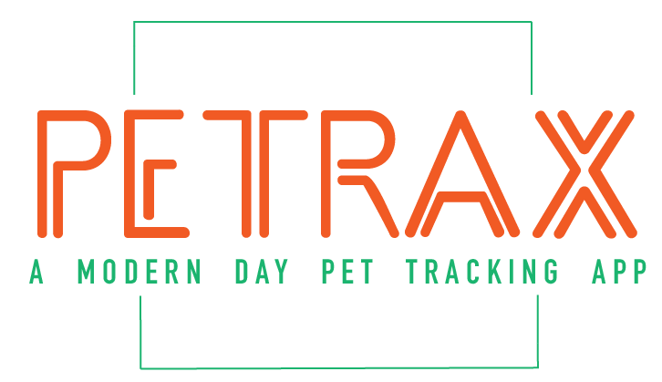

PETrax :paw_prints:

A dedicated platform for pet owners to ensure the well-being of their furry family members.

**Overview**

PETrax is an application built to help pet owners keep track of their pets' important dates, appointments, and overall health. Our mission is to offer a user-friendly tool for ensuring our pets receive the care they deserve.

**Technology Stack**

Frontend: 
Angular, Bootstrap

Backend: 
Spring Boot with Gradle

Database: 
SQL

***Getting Started***

**Frontend Setup**

Clone the repository:
bash
Copy code
git clone https://github.com/yourusername/PETrax.git
Navigate to the frontend project directory:
bash
Copy code
cd PETrax/frontend

Install dependencies:
bash
Copy code
npm install

Run the application:
bash
Copy code
ng serve
Visit http://localhost:4200/ in your browser.

**Backend Setup**
Navigate to the backend project directory:
bash
Copy code
cd PETrax/backend
Use Gradle to build the project:
bash
Copy code
./gradlew build
Run the application:
bash
Copy code
./gradlew bootRun
Your Spring Boot server should be running on http://localhost:8080/.

**Database Setup**
You should have a SQL server running (e.g., MySQL, PostgreSQL, MSSQL).
Update the application.properties or application.yml in the backend directory with your database configurations:

Copy code
spring.datasource.url=jdbc:mysql://localhost:3306/PETrax
spring.datasource.username=YOUR_DB_USERNAME
spring.datasource.password=YOUR_DB_PASSWORD

**Core Team**
Ryan Scoles
Delaney Green
Mars Lebeau
Jennifer Goldring
Tayler Edelen
with the support of Zoe Grey

**Feedback**
Since this is our MVP, we're eager to get feedback! Please open an issue or submit suggestions and feedback directly to our repository.

License
MIT License
